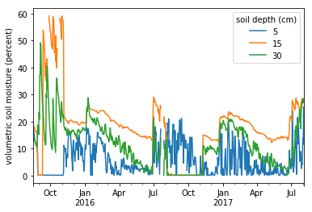

# Opening and visualizing a netCDF file in Python

*Author: Rupesh Shrestha*  
*Date: March 21, 2018*  
*Contact for ORNL DAAC: uso@daac.ornl.gov*

### Keywords: Python, netCDF, CSV, visualization, SoilSCAPE, soil moisture

## Overview

This tutorial demonstrates how to open and explore the netCDF file, visualize the data, and export to a comma-separated file (CSV). This tutorial is intended for the users with novice-level programming skills. However, it is expected that the users familiarize themselves with key aspects of [netCDF climate and forecast (CF) metadata convention](http://cfconventions.org/cf-conventions/v1.6.0/cf-conventions.html) before starting the tutorials.

## Source Data

The source data is a netCDF file ([soil_moist_20min_Kendall_AZ_n1400.nc](https://daac.ornl.gov/daacdata/eos_land_val/SoilSCAPE/data//soil_moist_20min_Kendall_AZ_n1400.nc)) consisting of  volumetric root zone soil moisture data from a location in Kendall, Arizona, USA. This data was collected as a part of SoilSCAPE (Soil moisture Sensing Controller and oPtimal Estimator) project (https://daac.ornl.gov/cgi-bin/dsviewer.pl?ds_id=1339)

## Prerequisites

Python 2.7 or later. Python modules: netCDF4, numpy, pandas, matplotlib
